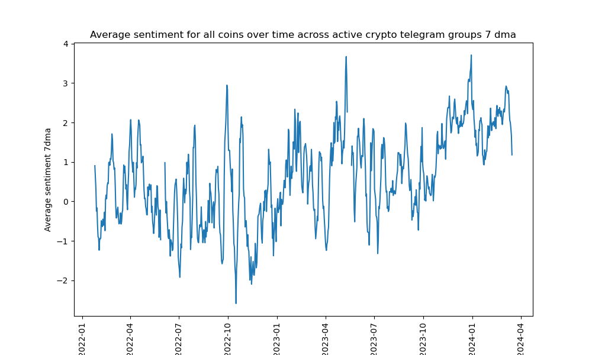
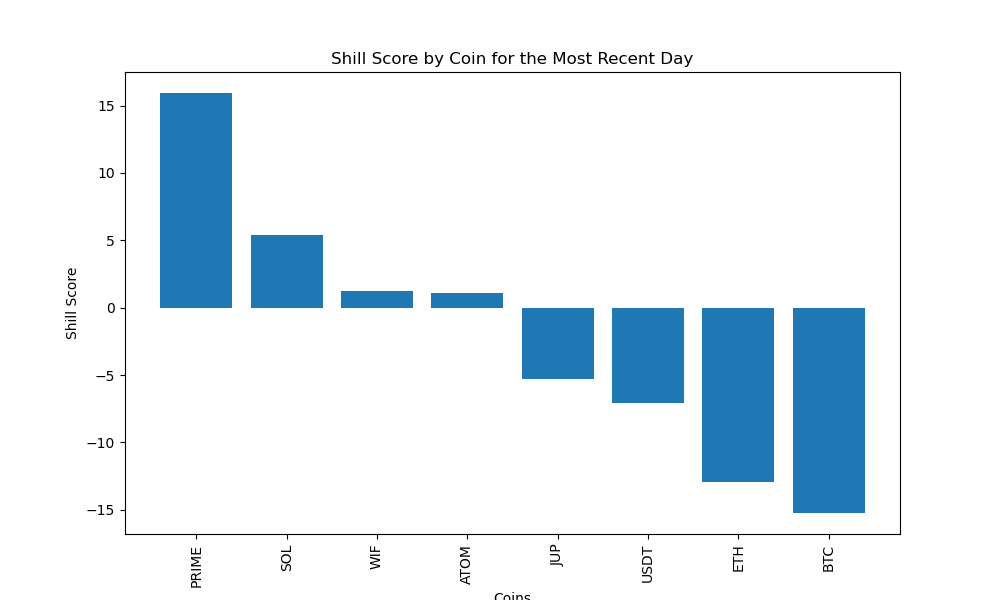
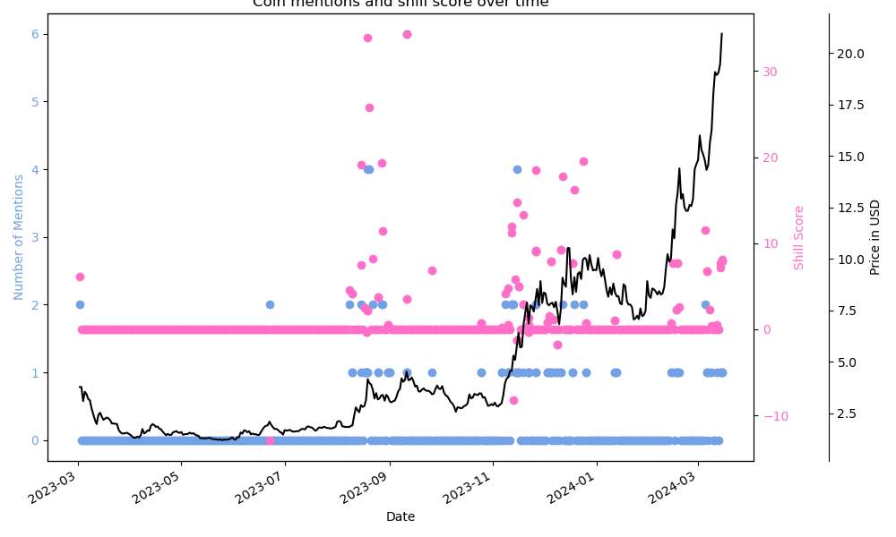

# Shillometer

Using sentiment analysis from crypto telegram groups and K means clustering to identify high conviction trade entries

### Problem statement: Crypto markets are heavily driven by sentiment and narratives. Explore scraping social media to get a sense for when these narratives might be building, in order to identify trade opportunities. To do this, scrape high volume public Telegram groups and perform sentiment analysis on the results, then use that data as a feature within a number of machine learning m models. If any of these models show promise, build a trade strategy and backtest this over the last 3-4 years, when. most of the major focus coins in today's market went live or saw their largest periods of price appreciation.

#### Data Collection

I used the Telethon library to scrape 12 active groups in Telegram. I managed to scrape around 200k comments over the last 2 years. I then created a function to identify the coins referenced in the comment, or in the earlier thread, if the message itself was a reply.

I then ran each comment through a Hugging Face library that had been trained on 124m tweets. More specifically, this was a roBERTa model (robustly optimized BERT pre-training approach, a pretrained NLP and hyperparameter optimised model which builds on BERT, an AI language model developed by Google in 2018 - Bidirectional Encoder Representations).

I found the accuracy to be much better than the initial vaderSentiment library that I had initially been using. The model outputs probabilities of the comment being negative, neutral or positive. I used these scores and multiplied by 10,0,-10 respectively to arrive at a score from -10/+10.

https://huggingface.co/cardiffnlp/twitter-roberta-base-sentiment-latest

This was done in Colab as the Hugging Face library generaly needed to be run on a GPU cluster. This file can be run on a sporadic basis and updated, and then master_sentiment_new.csv is imported back to the main notebook.

#### EDA

I first looked at the accuracy of the sentiment scoring across the last 10 comments and then refined for the >5 or <-5 scores. I found the accuracy to be somewhat on low conviction/neutral comments, and there were many of these as comment threads would often stray off topic and most comments were somewhat neutral or of low relevance. That said, I found the broad scoring approach, particularly for the higher scoring rows to be generally accurate, at least in identifying high convition positive or negative comments.

At the highest level, number of comments and sentiment over time were largely as expected over the last 2 years, with both picking up meaningfully in 2H23, once the market improved.

   
   

I then broke out the comments into individual coin references (as many comments had multiple coins) and initially used this to build a daily and weekly bar chart of the latest 'shills' with the feature 'shill score' as sentiment * number of comments.

   
   

I then built a coin specific dataframe, combining sentiment data and price/ technicals. I used this initially to create a 'shill chart', as below and could be useful in monitoring increasing hype/sentiment in real time.

#### Regression modelling

I then began to explore whether we could build a predictive model using the datasets on a coin specific basis. Initial correlation analysis was not desperately encouraging, with some small positive correlation for shill, sentiment, and number of mentions for Solana at least, but across 15 arge cap coins, the results were very weak. 

I then built a random forest model (I had initially tried linear regression with very weak results) against 7 day forward returns, which led to fairly weak results on test data (very strong 0.9 R^2 on training data hence the model was extremely overfit) and I had similar results from support vector machines regression.

I tried Shap analysis, which was slightly more encouraging, and showed there might be some weak positive correlation for shill score and number of mentions, and as below, we can see this was also the case for another coin, RNDR. 

Overall though, the results for regression models were not desperately encouraging.

#### Clustering

Which led me on to k-means clustering. My thinking was that individual features might not regress well - for example RSI works nicely during momentum runs, but then also precedes blow off tops and a high shill score could both precede a run but much more likely precede a top as the coin would be very well hyped and social media would be much more active - ie the incredibly high shill scores would be at market tops. In fact, looking at the Shap summary plot above, the highest sentiment scores did tend to precede very weak 14 day returns.

However there might well be clustered instances where the 'stars align' - for example let's say SOL in early October - at this point shill score is picking up, RSI is increasing but not elevated, volumes are meaningfully picking up with price increasing (and so CVD is increasing and AC_CVD is elevated), 10 vs 20 ema is rising and 10_20_acc (10/20 ema vs its own 5 day average, ie a measure of change in momentum) is high (signalling a turning of momentum). The telegram data might help us find an early heads up from an increasingly engaged and positive community and so combining this data with technical indicators to specifically target this early break out category could possibly work.

Essentially we are looking for the stars to align across a number of metrics and k-means might be able to identify these clusters in a way that regression couldn't.

So I used 5 clusters which I had troughly optimised using silhouette and inertia scores (ie using a number of clusters, 'k' to arrive at the most densely packed clusters across the various dimensions, or features). I did this without forward return data so that the model wouldn't learn future returns and be overfit, ie to avoid information leakage. I then appended the returns so that we could rank the clusters by forward return performance. Other than the top performing bucket which identified deep value/ oversold trades, the results for Solana showed a weak positive return to the social media data, but generally positive correlation to momentum features such as RSI or 10/20 ema. 

[boxplots]

#### The acid test

We then broke out performance by cluster using a strategy of holding for 14 days and cutting at a 10% stop loss. Of course this was identifying the strongest cluster after the fact but I found that there were certain clusters that significantly outperformed, in most cases due to the compound impact of being exposed to the 2021 bull run, along with early and late 2023. 

[SOL cluster diagram]

The algorithm appeared to identify early stage momentum breakout trades from the features - as show below in green for cluster 2, and managed to avoid being exposed during the worst drawdowns of the bear market, with the 10% stop loss as protection for the worst trades, specifically being long at market tops, preceding aggressive drawdowns.

[trades over time]

I then tried the same approach but using Principal Component Analysis for dimensionality reduction. I used 4 pricinpal components as this explained 70-80% of the variance in my data and I thought this migh help improve clustering. The results were mixed in terms of silhouette and inertia scores, but generally I found the backtested performance to be slightly better for the top performing clusters.

[2D PCA chart]
[3D PCA chart]

#### Using multifold time based train/test split to backtest

For a more robust approach, I used a 20 fold train/test split which basically ran the k means approach up to a specific time and then chose the top performing cluster during the tst period, only trading when that cluster's signal fired. This was repeated rughly every 1-2 months thereafter on updated training data. This way we would avoid cherry picking the top performing strategies.

I did this across 20 high profile large cap coins and the results were encouraging. While what is essntially a long focused momentum strategy should have done well starting in most cases in 2021. That said, 65% of the coin strategies made money, the average return was 170%, the average trade made 10.6% pre trading fees, though the hit rate was fairly miserable at 38%. 

Comparing this to ETH, which is a reasonable benchmark for most coins, the return over a similar period (assuming the strategies started in mid 2021- mid 2022 was roughly up 100% to flat depending on the starting point.

[Histograms]

#### So in conclusion, in answer to our original problem statement, it appears there may be some, albeit weak correlation between Telegram sentiment and Shill score and forward returns based on regression and Shap analysis. As part of a clustering strategy, the returns do seem to be fairly compelling, though there doesn't seem to be much positive correlation between the mean returns of the clusters and the shill score, sentiment or number of mentions. 

It seems that the returns seem to correlate well with more traditional momentum metrics like RSI, 10/20 EMA and also 10/20 acc (ie early change in momentum). While it is not shown above, looking at other coins, the clustering approach did generally identify early momentum clusters - ie being early to trades that performed very well and led to outsized returns. 

